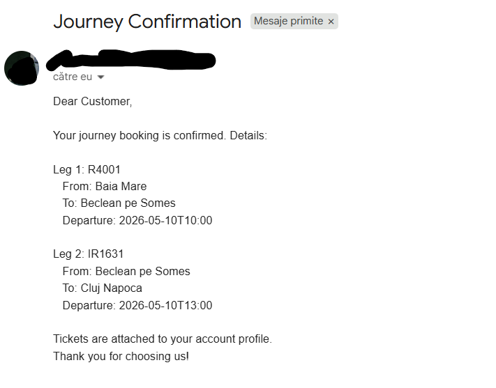
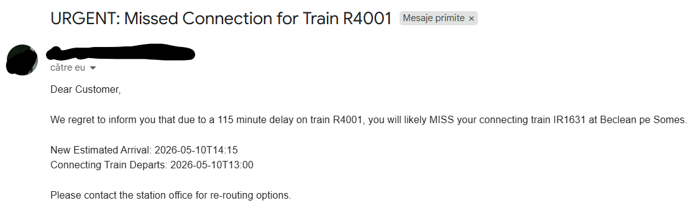

# Train Ticketing System - Demo & Submission Guide

 To run the application, use the command: ./mvnw spring-boot:run. This ensures that the environment variables are correctly loaded.

To test the API endpoints, follow these general steps in Postman:
Set Up Authentication
   Most endpoints require authentication. In Postman:
    Click on the Authorization tab.
    Select Basic Auth from the "Type" dropdown.
    Enter the email and password (e.g., admin@example.com / admin123).

## Overview
This application is a Spring Boot REST API designed to manage complex train networks. It handles everything from path searching and automated passenger notifications.

## Email Setup (Google SMTP)
To use real email notifications, you must use a Google App Password:
1. Enable 2-Factor Authentication on your Google Account.
2. Go to Security -> App Passwords.
3. Generate a password for 'Mail' on a 'Windows Computer'.
4. Use the resulting 16-character code (no spaces) as the EMAIL_PASS variable.

## Technical Stack
- **Spring Data JPA**: Database persistence and entity relationships.
- **Spring Security**: Basic Auth and Role-Based Access Control.
- **Spring Mail**: Automated asynchronous email notifications.
- **H2 Database**: In-memory storage for immediate local execution.
- **Lombok**: Reduced boilerplate code for models and services.

## Authentication
The API uses **Basic Authentication**.
- **Admin**: admin@example.com / admin123
- **User**: user@example.com / user123

---

## 1. Station Management (Admin Only)

### Add a Station
- **Method**: POST
- **URL**: http://localhost:8080/api/stations
- **Body**: { "name": "Oradea" }

```output:
{
    "id": 6,
    "name": "Oradea"
}
```

### List All Stations
- **Method**: GET
- **URL**: http://localhost:8080/api/stations

```output:
[
    {
        "id": 1,
        "name": "Baia Mare"
    },
    {
        "id": 5,
        "name": "Beclean pe Somes"
    },
    {
        "id": 4,
        "name": "Cluj Napoca"
    },
    {
        "id": 3,
        "name": "Dej Calatori"
    },
    {
        "id": 2,
        "name": "Jibou"
    },
    {
        "id": 6,
        "name": "Oradea"
    }
]
```

---

## 2. Route Management (Admin Only)

### Add a Route
- **Method**: POST
- **URL**: http://localhost:8080/api/routes
- **Body**:
```json
{
    "name": "CJ-OR Route",
    "routeStations": [
        { "station": { "id": 4 }, "stopOrder": 0, "travelTimeOffsetMinutes": 0 },
        { "station": { "id": 6 }, "stopOrder": 1, "travelTimeOffsetMinutes": 150 }
    ]
}
```

```output:
{
    "id": 6,
    "name": "CJ-OR Route",
    "routeStations": [
        {
            "id": 14,
            "station": {
                "id": 4,
                "name": null
            },
            "stopOrder": 0,
            "travelTimeOffsetMinutes": 0
        },
        {
            "id": 15,
            "station": {
                "id": 6,
                "name": null
            },
            "stopOrder": 1,
            "travelTimeOffsetMinutes": 150
        }
    ]
}
```


### Modify a Route (Update Name/Stations)
- **Method**: PUT
- **URL**: http://localhost:8080/api/routes/1
- **Body**: (Change the name or add/remove stations in the JSON list)

```output
{
             "name": "Updated BM-CJ Route",
             "routeStations": [
                 {
                     "station": { "id": 1 },
                     "stopOrder": 0,
                     "travelTimeOffsetMinutes": 0
                 },
             {
                    "station": { "id": 3 },
                    "stopOrder": 1,
                    "travelTimeOffsetMinutes": 90
                },
                {
                    "station": { "id": 4 },
                    "stopOrder": 2,
                    "travelTimeOffsetMinutes": 150
                }
            ]
}
```

### Delete a Route
- **Method**: DELETE
- **URL**: http://localhost:8080/api/routes/4

---

## 3. Train Management (Admin Only)

### Add a Train
- **Method**: POST
- **URL**: http://localhost:8080/api/trains
- **Body**:
```json
{
    "trainNumber": "R1234",
    "route": { "id": 1 },
    "capacity": 50,
    "baseDepartureTime": "2026-05-10T10:00:00"
}
```

output:
```output
{
    "id": 6,
    "trainNumber": "R1234",
    "route": {
        "id": 1,
        "name": null,
        "routeStations": null
    },
    "capacity": 50,
    "baseDepartureTime": "2026-05-10T10:00:00",
    "delayMinutes": 0,
    "actualDepartureTime": "2026-05-10T10:00:00"
}
```


### Delete a Train
- **Method**: DELETE
- **URL**: http://localhost:8080/api/trains/5

---

## 4. Passenger Operations (Public/User)

### Search for Routes (No Login Required)
- **Method**: GET
- **URL**: http://localhost:8080/api/bookings/search?fromStationId=1&toStationId=4
- **Requirement Met**: Finds direct and changeover routes. Returns 400 error if no link exists.

output:

```output
[
    {
        "legs": [
            {
                "trainNumber": "R4096",
                "fromStation": "Baia Mare",
                "toStation": "Cluj Napoca",
                "departureTime": "2026-05-10T08:00:00",
                "arrivalTime": "2026-05-10T11:00:00"
            }
        ],
        "totalDepartureTime": "2026-05-10T08:00:00",
        "totalArrivalTime": "2026-05-10T11:00:00"
    },
    {
        "legs": [
            {
                "trainNumber": "R4096",
                "fromStation": "Baia Mare",
                "toStation": "Jibou",
                "departureTime": "2026-05-10T08:00:00",
                "arrivalTime": "2026-05-10T09:00:00"
            },
            {
                "trainNumber": "IR1746",
                "fromStation": "Jibou",
                "toStation": "Cluj Napoca",
                "departureTime": "2026-05-10T15:00:00",
                "arrivalTime": "2026-05-10T17:00:00"
            }
        ],
        "totalDepartureTime": "2026-05-10T08:00:00",
        "totalArrivalTime": "2026-05-10T17:00:00"
    },
    {
        "legs": [
            {
                "trainNumber": "R4096",
                "fromStation": "Baia Mare",
                "toStation": "Jibou",
                "departureTime": "2026-05-10T08:00:00",
                "arrivalTime": "2026-05-10T09:00:00"
            },
            {
                "trainNumber": "R1234",
                "fromStation": "Jibou",
                "toStation": "Cluj Napoca",
                "departureTime": "2026-05-10T11:00:00",
                "arrivalTime": "2026-05-10T13:00:00"
            }
        ],
        "totalDepartureTime": "2026-05-10T08:00:00",
        "totalArrivalTime": "2026-05-10T13:00:00"
    },
    {
        "legs": [
            {
                "trainNumber": "R4096",
                "fromStation": "Baia Mare",
                "toStation": "Dej Calatori",
                "departureTime": "2026-05-10T08:00:00",
                "arrivalTime": "2026-05-10T10:00:00"
            },
            {
                "trainNumber": "IR1746",
                "fromStation": "Dej Calatori",
                "toStation": "Cluj Napoca",
                "departureTime": "2026-05-10T16:00:00",
                "arrivalTime": "2026-05-10T17:00:00"
            }
        ],
        "totalDepartureTime": "2026-05-10T08:00:00",
        "totalArrivalTime": "2026-05-10T17:00:00"
    },
    {
        "legs": [
            {
                "trainNumber": "R4096",
                "fromStation": "Baia Mare",
                "toStation": "Dej Calatori",
                "departureTime": "2026-05-10T08:00:00",
                "arrivalTime": "2026-05-10T10:00:00"
            },
            {
                "trainNumber": "IR1631",
                "fromStation": "Dej Calatori",
                "toStation": "Cluj Napoca",
                "departureTime": "2026-05-10T13:30:00",
                "arrivalTime": "2026-05-10T14:30:00"
            }
        ],
        "totalDepartureTime": "2026-05-10T08:00:00",
        "totalArrivalTime": "2026-05-10T14:30:00"
    },
    {
        "legs": [
            {
                "trainNumber": "R4096",
                "fromStation": "Baia Mare",
                "toStation": "Dej Calatori",
                "departureTime": "2026-05-10T08:00:00",
                "arrivalTime": "2026-05-10T10:00:00"
            },
            {
                "trainNumber": "R1234",
                "fromStation": "Dej Calatori",
                "toStation": "Cluj Napoca",
                "departureTime": "2026-05-10T12:00:00",
                "arrivalTime": "2026-05-10T13:00:00"
            }
        ],
        "totalDepartureTime": "2026-05-10T08:00:00",
        "totalArrivalTime": "2026-05-10T13:00:00"
    },
    {
        "legs": [
            {
                "trainNumber": "R1234",
                "fromStation": "Baia Mare",
                "toStation": "Cluj Napoca",
                "departureTime": "2026-05-10T10:00:00",
                "arrivalTime": "2026-05-10T13:00:00"
            }
        ],
        "totalDepartureTime": "2026-05-10T10:00:00",
        "totalArrivalTime": "2026-05-10T13:00:00"
    },
    {
        "legs": [
            {
                "trainNumber": "R4001",
                "fromStation": "Baia Mare",
                "toStation": "Beclean pe Somes",
                "departureTime": "2026-05-10T10:00:00",
                "arrivalTime": "2026-05-10T12:20:00"
            },
            {
                "trainNumber": "IR1631",
                "fromStation": "Beclean pe Somes",
                "toStation": "Cluj Napoca",
                "departureTime": "2026-05-10T13:00:00",
                "arrivalTime": "2026-05-10T14:30:00"
            }
        ],
        "totalDepartureTime": "2026-05-10T10:00:00",
        "totalArrivalTime": "2026-05-10T14:30:00"
    },
    {
        "legs": [
            {
                "trainNumber": "R1234",
                "fromStation": "Baia Mare",
                "toStation": "Jibou",
                "departureTime": "2026-05-10T10:00:00",
                "arrivalTime": "2026-05-10T11:00:00"
            },
            {
                "trainNumber": "IR1746",
                "fromStation": "Jibou",
                "toStation": "Cluj Napoca",
                "departureTime": "2026-05-10T15:00:00",
                "arrivalTime": "2026-05-10T17:00:00"
            }
        ],
        "totalDepartureTime": "2026-05-10T10:00:00",
        "totalArrivalTime": "2026-05-10T17:00:00"
    },
    {
        "legs": [
            {
                "trainNumber": "R1234",
                "fromStation": "Baia Mare",
                "toStation": "Dej Calatori",
                "departureTime": "2026-05-10T10:00:00",
                "arrivalTime": "2026-05-10T12:00:00"
            },
            {
                "trainNumber": "IR1746",
                "fromStation": "Dej Calatori",
                "toStation": "Cluj Napoca",
                "departureTime": "2026-05-10T16:00:00",
                "arrivalTime": "2026-05-10T17:00:00"
            }
        ],
        "totalDepartureTime": "2026-05-10T10:00:00",
        "totalArrivalTime": "2026-05-10T17:00:00"
    },
    {
        "legs": [
            {
                "trainNumber": "R1234",
                "fromStation": "Baia Mare",
                "toStation": "Dej Calatori",
                "departureTime": "2026-05-10T10:00:00",
                "arrivalTime": "2026-05-10T12:00:00"
            },
            {
                "trainNumber": "IR1631",
                "fromStation": "Dej Calatori",
                "toStation": "Cluj Napoca",
                "departureTime": "2026-05-10T13:30:00",
                "arrivalTime": "2026-05-10T14:30:00"
            }
        ],
        "totalDepartureTime": "2026-05-10T10:00:00",
        "totalArrivalTime": "2026-05-10T14:30:00"
    },
    {
        "legs": [
            {
                "trainNumber": "IR1746",
                "fromStation": "Baia Mare",
                "toStation": "Cluj Napoca",
                "departureTime": "2026-05-10T14:00:00",
                "arrivalTime": "2026-05-10T17:00:00"
            }
        ],
        "totalDepartureTime": "2026-05-10T14:00:00",
        "totalArrivalTime": "2026-05-10T17:00:00"
    }
]
```


---

## 5. Complex Scenario Sequences (The Demo)

### Sequence A: The Multi-Leg Journey
1. **Search**: Find a trip from Baia Mare (1) to Cluj (4). There will be 2-leg option (Trains 3 & 4).
2. **Book**: Login as User.
   - **Method**: POST
   - **URL**: http://localhost:8080/api/bookings?trainIds=3,4&fromStationIds=1,5&toStationIds=5,4&count=1
3. **Verify**: Login as Admin. Check GET http://localhost:8080/api/bookings/train/3 to see the user's new ticket.



### Sequence B: Insertion of Delays
1. **Scenario**: First, perform Sequence A above so the user has two connected tickets.
2. **Report Minor Delay**: Login as Admin.
   - **Method**: POST
   - **URL**: http://localhost:8080/api/trains/3/delay?minutes=15
   - **Effect**: User gets a Standard Delay Email because the 13:00 connection is still safe.
3. **Report Major Delay**: Login as Admin.
   - **Method**: POST
   - **URL**: http://localhost:8080/api/trains/3/delay?minutes=115
   - **Effect**: User gets an URGENT Missed Connection Email because they now arrive after 13:00.



---

## Configuration Note
The application supports Environment Variables (EMAIL_USER, EMAIL_PASS) for SMTP.
